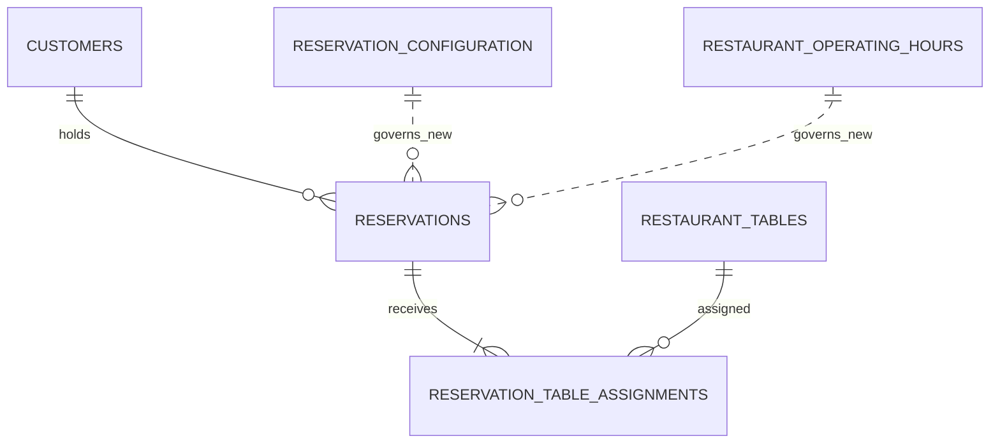

# Cafe Fausse DB-03 Logical PostgreSQL Schema and Integrity Design

**Document version:** 1.0  
**Established:** 2026-08-15  
**Roadmap increment:** DB-03  
**Authoritative sources:** `SRS(1).pdf`, `Rubric(1).pdf`, Project Requirements Addendum 2.2.1 (PRA-001 through PRA-029), approved DB-01 Persistent-Data Requirements Analysis 1.2.1, approved DB-02 Conceptual Data Model 1.2, and approved Least-to-Most Implementation Roadmap 1.1.1  
**Scope:** Logical PostgreSQL schema and integrity design only  
**Status:** Ready for DB-03 approval checkpoint  
**Code status:** No SQL or application code generated

## 1. Purpose and boundary

This document converts the approved six-concept model into an implementation-ready logical PostgreSQL schema. It fixes table and column names, PostgreSQL data types, keys, nullability, defaults, checks, referential actions, indexes, normalization, and responsibility boundaries.

It does not generate SQL, migrations, seed/reset scripts, functions, triggers, transactions, Flask/Python, React/JSX, or executable tests. DB-04 remains responsible for transaction boundaries, concurrency control, overlap/exclusivity enforcement, exact-retry ordering, allocation, random tie selection, and rollback behavior.

The design contains exactly six logical tables:

1. `customers`;
2. `reservation_configuration`;
3. `restaurant_operating_hours`;
4. `restaurant_tables`;
5. `reservations`;
6. `reservation_table_assignments`.

No genuine business-rule ambiguity was discovered. The choices in this document are technical DB-03 decisions presented for approval.

## 2. Logical design decisions

| Decision area | Selected logical design | Rationale |
|---|---|---|
| Customer identifier | Database-generated `BIGINT` identity | Simple, compact, stable, and adequate for an academic system. It remains internal. |
| Reservation identifier and confirmation reference | One database-generated `BIGINT` identity used as both Reservation ID and displayed confirmation reference | Satisfies the SRS and PRA-024 without duplicating identity. Version 1 has no public lookup endpoint or security rule requiring a separate opaque token. |
| Restaurant table identity | Positive `SMALLINT` table number as the primary key | The table number is already the stable SRS business identifier; a second surrogate key would add no value. |
| Canonical email | One lowercase, trimmed `VARCHAR(254)` value with a unique constraint | Stores one authoritative value, avoids a duplicate raw/normalized pair, requires no PostgreSQL extension, and provides deterministic identity. |
| Name representation | `VARCHAR(100)` first/last names and nullable `VARCHAR(1)` middle initial | Directly preserves approved structured-name limits and optionality. |
| Phone representation | Nullable `TEXT` | Approved validity depends on permitted characters and digit count, not an independently approved display-length limit. PostgreSQL and Flask validate it without a duplicate normalized-phone column. |
| Configuration | One row in `reservation_configuration`, identified by fixed key value `1` | A primary key plus fixed-value check guarantees at most one current row. Seed/rebuild verification guarantees that the row exists. |
| Duration-like configuration | Integer minute values | The approved values and ranges are whole minutes; integers are simpler to inspect, seed, validate, and expose than interval literals. |
| Recurring hours | Exactly one non-null same-day opening/closing pair per ISO weekday | Smallest structure satisfying PRA-029. Version 1 does not support closed weekdays, overnight service, multiple periods, exceptions, or history. |
| Weekday identity | ISO weekday number `1` through `7`, Monday through Sunday, stored as `SMALLINT` | Portable, compact, easily constrained, and directly compatible with PostgreSQL weekday calculations when mapped explicitly. |
| Recurring-hour temporal types | `TIME WITHOUT TIME ZONE` | Values are recurring restaurant-local wall-clock boundaries; the restaurant timezone is separately authoritative. |
| Reservation occupancy | Required `TIMESTAMP WITH TIME ZONE` start and end columns | Preserves two unambiguous immutable instants, makes `[start,end)` explicit, and prevents later duration changes from altering existing bookings. |
| Party size/capacity | Positive `INTEGER` values | Avoids an unnecessarily narrow business ceiling while remaining simple. Current maximum party size is derived, not stored. |
| Fingerprint version | Positive `SMALLINT`, default `1` | Compact numeric representation of semantic label `v1`; clients do not interpret it. |
| Fingerprint value | Required `BYTEA` | Stores opaque database-generated bytes without exposing or committing DB-03 to an encoding or hash algorithm. |
| Retry collision safety | Non-unique fingerprint lookup plus unique underlying tuple `(customer_id, starts_at, party_size)` | A collision may return multiple candidates, but cannot establish equality. The unique tuple prevents duplicate exact reservation identities independently of hash equality. |
| Assignment identity | Composite primary key `(reservation_id, table_number)` | The association has no independent attributes or lifecycle and each reservation-table pair may occur only once. |
| Referential deletions | Restrict/no-action behavior for all business relationships | Normal Version 1 operation retains data. Controlled reset must delete in explicit dependency order rather than hiding deletions behind cascades. |
| Technical timestamps | Omitted | No approved business, diagnostic, ordering, or audit need justifies customer/reservation created/updated columns. |
| PostgreSQL extensions | None required by DB-03 | The chosen logical schema uses built-in scalar types. DB-04/DB-05 must separately justify any extension required for the selected fingerprint or concurrency implementation. |

## 3. Logical entity-relationship diagram

The dotted relationships are behavioral only. No configuration or schedule foreign key is stored on `reservations`; every reservation preserves its own immutable occupancy facts.

## 4. Final logical table catalogue

| Table | Approved conceptual home | Purpose | Expected Version 1 population |
|---|---|---|---|
| `customers` | Customer | Stores identity, structured name, optional contact number, and the one current newsletter state. | Zero or more; one per canonical email. |
| `reservation_configuration` | Reservation Configuration | Stores the single current set of five scalar reservation policies. | Exactly one seeded row; key value `1`. |
| `restaurant_operating_hours` | Restaurant Operating Hours | Stores one current recurring opening/closing rule for each weekday. | Exactly seven seeded rows; weekday values `1` through `7`. |
| `restaurant_tables` | Restaurant Table | Stores the 30 table numbers and their individual current capacities. | Exactly 30 seeded rows in normal Version 1 operation. |
| `reservations` | Reservation | Stores immutable confirmed booking identity, customer, interval, party size, and retry identity. | Zero or more; retained after occupancy ends. |
| `reservation_table_assignments` | Reservation-Table Assignment | Stores every table committed to every confirmed reservation. | One or more rows per reservation. |

## 5. Complete column-level data dictionary

### 5.1 `customers`

| Column | PostgreSQL type | Null? | Default/generation | Logical rules and meaning |
|---|---|---:|---|---|
| `customer_id` | `BIGINT` identity | No | Database generated | Primary key; stable internal SRS Customer ID; immutable. |
| `first_name` | `VARCHAR(100)` | No | None | Trimmed/collapsed display value; 1-100 characters; at least one letter. |
| `middle_initial` | `VARCHAR(1)` | Yes | `NULL` | One stored uppercase alphabetic character without a period when supplied. |
| `last_name` | `VARCHAR(100)` | No | None | Trimmed/collapsed display value; 1-100 characters; at least one letter. |
| `email` | `VARCHAR(254)` | No | None | Required trimmed lowercase canonical email; unique business identity. |
| `phone` | `TEXT` | Yes | `NULL` | Preserved approved display value; allowed punctuation and 7-15 digits when present. |
| `newsletter_subscribed` | `BOOLEAN` | No | `FALSE` | The only current newsletter source of truth. |

No confirmation email, normalized-phone column, raw-email duplicate, timestamps, authentication, profile, or newsletter-history column is included.

PostgreSQL checks persisted canonical form, lengths, coarse character rules, and uniqueness. Flask performs full Unicode-aware name normalization/matching, email syntax validation, confirmation-email equality, phone digit normalization/comparison, and limited populate/preserve/reject workflow rules.

### 5.2 `reservation_configuration`

| Column | PostgreSQL type | Null? | Default | Logical rules and meaning |
|---|---|---:|---|---|
| `configuration_id` | `SMALLINT` | No | `1` | Primary key and singleton discriminator; only value `1` is valid. |
| `start_interval_minutes` | `SMALLINT` | No | `30` | Permitted values `15`, `30`, `60`. |
| `reservation_duration_minutes` | `SMALLINT` | No | `90` | Permitted values `60`, `90`, `120`. |
| `advance_booking_window_days` | `SMALLINT` | No | `60` | Inclusive range `1` through `365`. |
| `same_day_lead_minutes` | `SMALLINT` | No | `120` | Inclusive range `0` through `1440`. |
| `restaurant_timezone` | `TEXT` | No | `America/New_York` | Trimmed, nonempty IANA timezone identifier; validated against PostgreSQL-supported timezone names by controlled configuration logic. |

The fixed singleton key guarantees at most one current row. PostgreSQL has no declarative assertion that can guarantee at least one row remains; migration, seed, permission, and integration checks preserve row existence.

Timezone membership cannot be expressed by a simple immutable row check against PostgreSQL's timezone catalogue. The database stores the authoritative value; controlled configuration logic validates candidate values against the database-supported IANA catalogue before commit.

### 5.3 `restaurant_operating_hours`

| Column | PostgreSQL type | Null? | Default | Logical rules and meaning |
|---|---|---:|---|---|
| `weekday` | `SMALLINT` | No | None | Primary key; ISO `1=Monday` through `7=Sunday`. |
| `opens_at` | `TIME WITHOUT TIME ZONE` | No | None | Restaurant-local recurring opening boundary. |
| `closes_at` | `TIME WITHOUT TIME ZONE` | No | None | Restaurant-local recurring closing boundary; must be later than `opens_at`. |

The primary key guarantees at most one rule per weekday. The `1`-through-`7` check limits the table to seven possible weekday identities. Seed and verification tests guarantee that all seven exist.

Required seed state:

| ISO weekday | Day | Opens | Closes |
|---:|---|---|---|
| 1 | Monday | 5:00 PM | 11:00 PM |
| 2 | Tuesday | 5:00 PM | 11:00 PM |
| 3 | Wednesday | 5:00 PM | 11:00 PM |
| 4 | Thursday | 5:00 PM | 11:00 PM |
| 5 | Friday | 5:00 PM | 11:00 PM |
| 6 | Saturday | 5:00 PM | 11:00 PM |
| 7 | Sunday | 5:00 PM | 9:00 PM |

Non-null boundaries intentionally mean that every weekday has one open period. Closed weekdays, overnight periods, multiple daily periods, exceptional dates, and history are excluded from Version 1.

### 5.4 `restaurant_tables`

| Column | PostgreSQL type | Null? | Default | Logical rules and meaning |
|---|---|---:|---|---|
| `table_number` | `SMALLINT` | No | None | Positive primary key and stable SRS Table Number. |
| `seating_capacity` | `INTEGER` | No | `4` | Positive current seating capacity; initialized to four. |

Version 1 seed data uses table numbers `1` through `30`, each with capacity four. The schema checks only positive table numbers and therefore does not make 30 a permanent physical maximum. Exactly 30 rows is a normal-operation population invariant enforced by seed/reset controls, application privileges, and verification tests rather than by an unapproved active/inactive flag.

### 5.5 `reservations`

| Column | PostgreSQL type | Null? | Default/generation | Logical rules and meaning |
|---|---|---:|---|---|
| `reservation_id` | `BIGINT` identity | No | Database generated | Primary key, SRS Reservation ID, and stable confirmation reference. |
| `customer_id` | `BIGINT` | No | None | Required foreign key to `customers.customer_id`; immutable owner. |
| `starts_at` | `TIMESTAMP WITH TIME ZONE` | No | None | Immutable canonical start instant. |
| `ends_at` | `TIMESTAMP WITH TIME ZONE` | No | None | Immutable exclusive end instant; must be later than `starts_at`. |
| `party_size` | `INTEGER` | No | None | Immutable positive guest count; current maximum and assignment coverage are transaction-time derivations. |
| `fingerprint_version` | `SMALLINT` | No | `1` | Positive semantic version for retry fingerprint input/encoding rules. |
| `reservation_fingerprint` | `BYTEA` | No | Database generated during booking | Opaque, nonempty, deterministic retry lookup value. |

The stored interval is always interpreted as `[starts_at, ends_at)`. The elapsed duration must be one of the approved reservation durations: 60, 90, or 120 minutes. This check protects direct writes while current configuration is revalidated transactionally for new bookings.

The tuple `(customer_id, starts_at, party_size)` is uniquely constrained because it is the approved exact-retry identity. This constraint prevents duplicate equivalent reservations even if fingerprint generation or lookup is mishandled. It does not prevent a different same-customer overlap; that interval rule remains DB-04.

`reservation_fingerprint` is deliberately not unique. A hash collision must be representable so the underlying tuple can be compared before declaring equality. The database-generated algorithm, encoding, exact length, and booking-time creation mechanism remain DB-04/DB-05 decisions.

No status, cancellation, modification, configuration snapshot, newsletter snapshot, assigned-capacity snapshot, delivery state, or created/updated timestamp is included.

### 5.6 `reservation_table_assignments`

| Column | PostgreSQL type | Null? | Default | Logical rules and meaning |
|---|---|---:|---|---|
| `reservation_id` | `BIGINT` | No | None | Foreign key to `reservations.reservation_id`; first component of primary key. |
| `table_number` | `SMALLINT` | No | None | Foreign key to `restaurant_tables.table_number`; second component of primary key. |

The composite primary key is the association identity. No independent assignment ID, copied interval, copied capacity, allocation rank, unused-seat count, or random-choice value is stored.

## 6. Key and referential-action catalogue

### 6.1 Primary and natural keys

| Table | Primary key | Natural/business uniqueness |
|---|---|---|
| `customers` | `customer_id` | `email` uniquely identifies one customer. |
| `reservation_configuration` | `configuration_id` | Fixed singleton key `1`. |
| `restaurant_operating_hours` | `weekday` | ISO weekday is the natural identity. |
| `restaurant_tables` | `table_number` | Table number is both natural and primary identity. |
| `reservations` | `reservation_id` | `(customer_id, starts_at, party_size)` is the exact-retry business identity. |
| `reservation_table_assignments` | `(reservation_id, table_number)` | Same as primary key; each pair occurs once. |

### 6.2 Foreign keys and actions

| Child relationship | Parent | Update action | Delete action | Rationale |
|---|---|---|---|---|
| `reservations.customer_id` | `customers.customer_id` | Restrict/no action | Restrict/no action | Customer identity is immutable and retained; a reservation may never become orphaned. |
| `reservation_table_assignments.reservation_id` | `reservations.reservation_id` | Restrict/no action | Restrict/no action | Assignments and reservations are retained. Controlled reset deletes assignments explicitly before reservations. |
| `reservation_table_assignments.table_number` | `restaurant_tables.table_number` | Restrict/no action | Restrict/no action | Stable assigned table identity may not be changed or removed while referenced. |

No foreign key uses automatic cascading deletion. This makes accidental destructive writes fail visibly and keeps controlled reset ordering explicit.

## 7. Constraint catalogue

### 7.1 PostgreSQL declarative constraints

| Logical constraint | Table/columns | Enforcement purpose |
|---|---|---|
| `customers_pk` | `customers.customer_id` | Stable customer identity. |
| `customers_email_uq` | `customers.email` | One customer per canonical email. |
| `customers_first_name_ck` | `first_name` | Length 1-100, trimmed/collapsed persisted form, at least one alphabetic character. |
| `customers_middle_initial_ck` | `middle_initial` | Null or one uppercase alphabetic character. |
| `customers_last_name_ck` | `last_name` | Length 1-100, trimmed/collapsed persisted form, at least one alphabetic character. |
| `customers_email_canonical_ck` | `email` | Nonempty, no outer whitespace, lowercase, maximum 254 characters. |
| `customers_phone_ck` | `phone` | Null or approved characters with 7-15 digits. |
| `reservation_configuration_pk` | `configuration_id` | Current configuration identity. |
| `reservation_configuration_singleton_ck` | `configuration_id` | Only singleton value `1` is allowed. |
| `reservation_configuration_interval_ck` | `start_interval_minutes` | Only 15, 30, or 60. |
| `reservation_configuration_duration_ck` | `reservation_duration_minutes` | Only 60, 90, or 120. |
| `reservation_configuration_window_ck` | `advance_booking_window_days` | Inclusive range 1-365. |
| `reservation_configuration_lead_ck` | `same_day_lead_minutes` | Inclusive range 0-1440. |
| `reservation_configuration_timezone_ck` | `restaurant_timezone` | Trimmed nonempty bounded technical text; IANA membership is separately validated. |
| `restaurant_operating_hours_pk` | `weekday` | At most one current rule per weekday. |
| `restaurant_operating_hours_weekday_ck` | `weekday` | ISO weekday range 1-7. |
| `restaurant_operating_hours_bounds_ck` | `opens_at`, `closes_at` | Non-null same-day opening strictly before closing. |
| `restaurant_tables_pk` | `table_number` | Stable unique Table Number. |
| `restaurant_tables_number_ck` | `table_number` | Positive identifier. |
| `restaurant_tables_capacity_ck` | `seating_capacity` | Positive capacity. |
| `reservations_pk` | `reservation_id` | Stable Reservation ID/confirmation reference. |
| `reservations_customer_fk` | `customer_id` | Every reservation belongs to one customer. |
| `reservations_interval_ck` | `starts_at`, `ends_at` | End strictly after start; establishes a nonempty half-open interval. |
| `reservations_duration_ck` | `starts_at`, `ends_at` | Elapsed duration is 60, 90, or 120 minutes. |
| `reservations_party_size_ck` | `party_size` | Positive integer. |
| `reservations_fingerprint_version_ck` | `fingerprint_version` | Positive semantic version. |
| `reservations_fingerprint_ck` | `reservation_fingerprint` | Non-null and nonempty bytes. |
| `reservations_exact_identity_uq` | `customer_id`, `starts_at`, `party_size` | Prevents duplicate equivalent reservations independently of fingerprint collisions. |
| `reservation_table_assignments_pk` | `reservation_id`, `table_number` | Prevents duplicate table assignment within one reservation. |
| Assignment foreign keys | Both assignment columns | Prevent orphan assignments. |

The name/email/phone checks are defense in depth. Flask still performs the approved Unicode-aware and user-message validation because a simple database pattern is not a complete international name or email validator.

### 7.2 Invariants not expressible by ordinary row constraints

| Invariant | DB-03 support | Final enforcement location |
|---|---|---|
| At least one configuration row exists | Only key value `1` is permitted. | DB-05 seed, restricted privileges, and tests. |
| Seven weekday rows exist | Weekday key/range allows exactly seven identities. | DB-05 seed/reset and tests. |
| Exactly 30 restaurant-table rows exist | Positive unique table numbers and capacity. | DB-05 seed/reset, restricted privileges, and tests. |
| Valid IANA timezone | Authoritative text value stored. | Controlled database-aware configuration validation and tests. |
| Current maximum party size | Positive stored party size; capacities are queryable. | Derived sum and booking-time validation. |
| Start is aligned, within window/lead/hours, and ends by close | Immutable interval and current configuration/hours are stored. | Flask plus authoritative DB-04 booking revalidation. |
| Same customer has no different overlapping reservation | Customer and intervals are indexed. | DB-04 transaction/concurrency mechanism. |
| Every reservation has at least one assignment | Assignment relationship exists. | DB-04 all-or-none transaction. |
| Assigned capacity covers party size | Party size and table capacities are queryable. | DB-04 allocation transaction. |
| No table has overlapping assignments | Assignment-to-reservation interval join is supported. | DB-04 concurrency/exclusivity mechanism. |
| Reservation plus all assignments commit atomically | Schema has required relationships. | DB-04 transaction boundary. |
| Fingerprint is generated from only approved inputs | Version/value and underlying tuple are stored. | DB-04/DB-05 database-generation mechanism. |
| Fingerprint match is verified against underlying facts | Unique underlying tuple and lookup index exist. | DB-04 retry ordering and collision verification. |
| Persisted business facts remain immutable | Keys/FKs and no update-oriented columns support immutability. | Database roles/privileges and DB-04 operations; no general update API. |

## 8. Nullability and default catalogue

All columns are `NOT NULL` except `customers.middle_initial` and `customers.phone`.

Defaults are limited to approved or structural values:

| Column | Default | Reason |
|---|---|---|
| Identity columns | Database-generated identity | Stable internal identifiers. |
| `customers.newsletter_subscribed` | `FALSE` | Every customer needs a current Boolean; affirmative signup/booking may explicitly set true. |
| `reservation_configuration.configuration_id` | `1` | Singleton structure. |
| `reservation_configuration.start_interval_minutes` | `30` | PRA-006 default. |
| `reservation_configuration.reservation_duration_minutes` | `90` | PRA-007 default. |
| `reservation_configuration.advance_booking_window_days` | `60` | PRA-010 default. |
| `reservation_configuration.same_day_lead_minutes` | `120` | PRA-011 default. |
| `reservation_configuration.restaurant_timezone` | `America/New_York` | PRA-012 default. |
| `restaurant_tables.seating_capacity` | `4` | PRA-017 initial/default capacity. |
| `reservations.fingerprint_version` | `1` | PRA-027 initial semantic version. |

No reservation start, end, party size, customer relationship, operating-hour boundary, table number, or assignment receives a silent business default.

## 9. Logical index catalogue and redundancy analysis

### 9.1 Constraint-owned indexes

PostgreSQL automatically provides indexes for primary keys and unique constraints. No duplicate manual index is added for:

- `customers.customer_id`;
- `customers.email`;
- `reservation_configuration.configuration_id`;
- `restaurant_operating_hours.weekday`;
- `restaurant_tables.table_number`;
- `reservations.reservation_id`;
- `reservations(customer_id, starts_at, party_size)`;
- `reservation_table_assignments(reservation_id, table_number)`.

### 9.2 Additional indexes

| Index | Columns | Unique? | Purpose | Why not redundant |
|---|---|---:|---|---|
| `reservations_fingerprint_lookup_idx` | `fingerprint_version`, `reservation_fingerprint` | No | Find retry candidates before underlying-fact verification. | Fingerprint must allow collisions and is not covered by any key. |
| `reservations_customer_interval_idx` | `customer_id`, `starts_at`, `ends_at` | No | Support same-customer interval checks and retained-history queries. | Exact-identity uniqueness lacks `ends_at` and serves equality, not general overlap. |
| `reservations_interval_idx` | `starts_at`, `ends_at` | No | Support interval/date candidate scans used by availability. | No existing index begins with global start/end values. |
| `reservation_table_assignments_table_idx` | `table_number`, `reservation_id` | No | Find all reservations associated with a candidate table. | The primary key begins with `reservation_id`, so it does not efficiently serve table-first lookup. |

The customer foreign key is supported by the customer-interval and exact-identity indexes. The assignment foreign keys are supported by the composite primary key and table-first index. Weekday lookup uses its primary-key index. No separate indexes are added to Boolean newsletter state, capacities, or scalar configuration because no approved high-selectivity query requires them.

A range/GiST index, exclusion-related index, or advisory-lock key is not selected here. DB-04 may replace or augment interval access paths if its approved exclusivity mechanism justifies doing so.

## 10. PostgreSQL versus Flask responsibility matrix

| Rule or behavior | PostgreSQL declarative | DB-04 transactional | Flask | Derived/display/excluded |
|---|---:|---:|---:|---|
| Stable entity keys | Yes | - | Uses keys internally | - |
| Canonical email uniqueness/lowercase persistence | Yes | Concurrent create handling | Normalizes and validates syntax | React validates provisionally |
| First/last required and bounded | Yes | - | Unicode-aware normalization and matching | React gives immediate feedback |
| Middle initial stored normalized | Yes | Existing-value update workflow | Validates input and populate/preserve/reject behavior | - |
| Phone persisted character/digit integrity | Yes, defense in depth | Existing-value update workflow | Validates and compares normalized digits | Normalized digits not stored |
| Current newsletter Boolean | Yes | Atomic/last-committed semantics | Orchestrates dedicated and booking-linked requests | No history |
| Configuration allowed values | Yes | - | Reads and applies values | React is not authoritative |
| Valid IANA timezone | Stores checked text | Controlled update validation | Converts/renders restaurant-local time | Browser timezone is not authoritative |
| One current configuration row exists | At most one | - | - | Seed/permissions/tests guarantee presence |
| One row per weekday and valid bounds | Yes | - | Reads current schedule | Seed/tests guarantee all seven |
| Exactly 30 tables | Row validity only | - | Uses current inventory | Seed/permissions/tests guarantee count |
| Total capacity/maximum party size | - | Derives authoritatively | Returns safe bound | Never stored |
| Reservation interval nonempty and approved duration | Yes | Revalidates current duration | Validates requested slot | - |
| Window/lead/alignment/open-close rules | Schema supplies facts | Authoritative booking revalidation | Calculates/validates request | Slot list is derived |
| Exact duplicate identity | Unique underlying tuple | Return existing reservation | Maps result to confirmation | - |
| Fingerprint storage/version | Yes | Generate, look up, collision-check | Clients never generate it | Fingerprint may be returned opaquely |
| Same-customer overlap | Indexed facts | Enforces under concurrency | Returns safe conflict | Not stored |
| Table availability/exclusivity | Indexed facts | Enforces under concurrency | Requests/returns outcomes | Availability not stored |
| Minimum tables/least waste/random tie | Schema supplies capacity/identity | Selects/commits winner | Does not duplicate database allocation | Candidate data transient |
| At least one/all-or-none assignments | PK/FK support | Enforces atomically | Maps committed result | - |
| Friendly messages/logging | - | Returns classified result | Maps/redacts/logs | No technical log table required |
| React authority | None | None | API is authoritative | React displays and performs provisional validation only |

## 11. Availability, overlap, and retry support

The schema supports availability without persisting it:

1. `restaurant_operating_hours` supplies the requested ISO weekday boundaries.
2. `reservation_configuration` supplies interval, duration, date-window, lead, and timezone values.
3. `restaurant_tables` supplies the 30 table identities and current capacities.
4. `reservations` supplies immutable half-open intervals, customer ownership, party size, and retry identity.
5. `reservation_table_assignments` supplies the winning exclusive table relationships.
6. Table-first, customer-interval, global-interval, and fingerprint indexes provide candidate access paths.

Back-to-back intervals remain possible because an interval ending at the next interval's start does not overlap. Different customers may overlap when their committed table sets remain disjoint and capacity-sufficient. A different overlapping request from the same customer is rejected even when other tables remain.

DB-03 does not claim that keys, checks, or B-tree indexes alone prevent double booking. DB-04 must select and prove the transaction/concurrency mechanism.

Exact retry support is collision-safe:

- PostgreSQL generates a versioned opaque fingerprint from customer ID, start instant, and party size.
- The non-unique fingerprint index returns candidates.
- The stored underlying tuple is compared.
- The unique tuple prevents a second equivalent reservation.
- A collision with a different tuple remains representable and is not treated as equality.
- Newsletter state/action is absent from the fingerprint and no retry event is stored.

## 12. Normalization and source-of-truth assessment

### 12.1 First normal form

All columns are scalar. Multi-table assignment is represented by one association row per table rather than a list in `reservations`. Names are structured into approved components rather than stored as an ambiguous composite field.

### 12.2 Second normal form

The only composite key is on `reservation_table_assignments`. That table has no non-key attributes, so no value depends on only part of the key.

### 12.3 Third normal form

Every non-key column depends only on its table's key:

- newsletter state depends on customer identity;
- scalar reservation rules depend on the singleton configuration identity;
- weekday boundaries depend on weekday identity;
- capacity depends on table number;
- occupancy, party size, and fingerprint facts depend on reservation identity;
- assignment contains only the reservation-table relationship.

The schema contains no transitive duplicate for customer name/email on reservation, reservation interval on assignment, table capacity on assignment, total capacity, maximum party size, availability, latest start, or confirmation.

### 12.4 Authoritative homes

| Information | Single logical home |
|---|---|
| Customer identity/name/email/phone/current newsletter status | `customers` |
| Current scalar reservation policies | `reservation_configuration` |
| Current recurring weekly hours | `restaurant_operating_hours` |
| Table identity and current capacity | `restaurant_tables` |
| Confirmed identity/customer/interval/party/fingerprint | `reservations` |
| Winning table relationships | `reservation_table_assignments` |
| Total capacity, maximum party size, availability, slots, candidates, confirmation | Derived; no stored home |

## 13. SRS minimum-field reconciliation

| SRS requirement | Logical representation | Additive compliance explanation |
|---|---|---|
| Customers Table | `customers` | Uses the recognizable required table and adds approved normalization. |
| Customer ID | `customers.customer_id` | Direct stable SRS identifier. |
| Customer Name | `first_name`, optional `middle_initial`, `last_name` | Components collectively preserve the required name and support deterministic matching. |
| Email Address | `customers.email` | One canonical unique value serves reservation identity and newsletter storage. |
| Phone Number | `customers.phone` | Optional as required; no duplicate comparison source. |
| Newsletter Signup | `customers.newsletter_subscribed` | Required current Boolean and only newsletter source. |
| Reservations Table | `reservations` | Uses the recognizable required table and adds facts necessary for availability/retry. |
| Reservation ID | `reservations.reservation_id` | Also supplies the stable confirmation reference. |
| Customer ID | `reservations.customer_id` | Required foreign key to Customers. |
| Time Slot | `starts_at`, `ends_at` | Start preserves the selection; end makes occupancy/closing/overlap operational and immutable. |
| Table Number | `reservation_table_assignments.table_number` | One row preserves one Table Number; multiple rows additively support approved larger parties. |
| Number of Guests | `reservations.party_size` | Persists an explicit SRS form value omitted only from the minimum field list. |
| Thirty tables | 30 seeded `restaurant_tables` rows | Makes table identity/capacity authoritative without changing the SRS count. |
| Required SRS hours | Seven seeded `restaurant_operating_hours` rows | Preserves exact SRS values while preventing Flask/React duplication. |
| Confirmation/full behavior | Reservation/assignment facts and derived availability | Supplies stable committed evidence without a duplicate confirmation entity. |

## 14. DB-02 concept-to-logical-table coverage

| DB-02 concept | DB-03 table | Coverage result |
|---|---|---|
| Customer | `customers` | Complete: identity, structured name, optional phone, canonical email, current newsletter state. |
| Reservation Configuration | `reservation_configuration` | Complete: all five current settings and approved defaults/ranges. |
| Restaurant Operating Hours | `restaurant_operating_hours` | Complete: one current rule for every ISO weekday and exact SRS seed. |
| Restaurant Table | `restaurant_tables` | Complete: stable table number and individual positive capacity; 30-row seed invariant. |
| Reservation | `reservations` | Complete: stable ID/confirmation, customer, immutable interval, party size, fingerprint/version. |
| Reservation-Table Assignment | `reservation_table_assignments` | Complete: normalized unique reservation-table pairs with no duplicated attributes. |

All conceptual relationships and optionalities are supported. Transaction-only minimum cardinality from Reservation to Assignment remains explicitly deferred to DB-04.

## 15. DB-01 data-item coverage confirmation

| DB-01 items | DB-03 treatment |
|---|---|
| CUS-01 to CUS-05, CUS-07, CUS-09 | Persisted once in `customers`. |
| CUS-06, CUS-10 | Transient request values; not stored. |
| CUS-08 | Derived by Flask for comparison; no duplicate stored value. |
| CUS-11 | Omitted technical timestamps; no approved need. |
| CFG-01 to CFG-05 | Persisted once in `reservation_configuration`. |
| FIX-01 | Persisted once in `restaurant_operating_hours` under PRA-029. |
| CFG-06 | Excluded configuration history. |
| TBL-01, TBL-02 | Persisted once in `restaurant_tables`. |
| TBL-03 | Derived/verified row count, not a setting. |
| TBL-04, TBL-05 | Derived sums/bounds, not stored. |
| TBL-06, TBL-07 | Excluded active flag and adjacency/combinability. |
| RSV-01 to RSV-07 | Persisted once in `reservations`; customer relationship is a foreign key. |
| RSV-08 | Omitted technical timestamp; no approved need. |
| RSV-09, RSV-10 | Excluded status/cancellation/modification data. |
| ASN-01 | Persisted once in `reservation_table_assignments`. |
| ASN-02 to ASN-05 | Derived from parent facts or transient allocation data; not stored. |
| AVL-01 to AVL-10 | Transient/derived availability inputs and outcomes; no availability ledger. |
| CNF-01 | `reservations.reservation_id`. |
| CNF-02 to CNF-06 | Derived from authoritative Customer, Reservation, Assignment, and current newsletter facts. |
| CNF-07 | Fixed SRS content outside PostgreSQL business persistence. |
| CNF-08 | Excluded delivery state. |

All 58 DB-01 items retain exactly one persistent/configured home or an explicit derived, transient, technical-omitted, fixed, or future-enhancement classification.

## 16. Requirements traceability

### 16.1 SRS and rubric

| Requirement | DB-03 coverage |
|---|---|
| SRS FR-02 | Exact weekly hours are defined as the required PostgreSQL seed. |
| SRS FR-06 | Time slot, party size, structured name, email, and optional phone have authoritative representations or transient validation paths. |
| SRS FR-07 | Hours/configuration/interval/capacity facts and indexes support authoritative valid/available checks. |
| SRS FR-08 | Thirty persistent tables and normalized assignments support random available assignment; final algorithm is DB-04. |
| SRS FR-09 | Stable Reservation ID and committed facts support confirmation; derived availability supports full/error outcomes. |
| SRS FR-15/FR-16 | Canonical email validation/storage and current newsletter Boolean support the dedicated form and database effects. |
| SRS FR-17 | Recognizable `customers` and `reservations` tables include all minimum fields through additive normalization. |
| SRS FR-18 | Schema supports customer insert/reuse, availability, assignment, and confirmation while Flask remains the orchestration layer. |
| SRS NFR-05 | Keys, constraints, retention, and DB-04 deferral protect integrity and reliability. |
| SRS NFR-09 | Complete naming, data dictionary, constraints, indexes, and traceability support maintainability/documentation. |
| Rubric score 5 - all SRS requirements | Every database-applicable SRS field and behavior is mapped. |
| Rubric score 5 - correct Flask/database/React integration | PostgreSQL owns persistence/hours/integrity, Flask is authoritative for orchestration, and React owns no business truth. |
| Rubric score 5 - direct database effects | Customer/newsletter, operating hours, tables, reservations, and assignments are directly inspectable. |
| Rubric score 5 - sophisticated reservation logic | The schema supports configuration, immutable intervals, capacities, multi-table assignment, retry, and future DB-04 concurrency proof. |

### 16.2 PRA-001 through PRA-029

| PRA | DB-03 treatment |
|---|---|
| PRA-001 | Remains in PostgreSQL design; no Flask/React implementation. |
| PRA-002 | Uses the smallest six-table normalized schema. |
| PRA-003 | Defines non-executable unit/integration review cases. |
| PRA-004 | Every schema fact traces to SRS, rubric, or approved PRA. |
| PRA-005 | Approved variable rules are database-backed; no unnecessary hard-coded duplication. |
| PRA-006 | Stores allowed start intervals and default 30. |
| PRA-007 | Stores allowed current duration and immutable reservation end. |
| PRA-008 | Stores the recurring seven-day SRS schedule; no exceptions. |
| PRA-009 | Stores opening/closing and occupancy facts; latest start remains derived. |
| PRA-010 | Stores 1-365-day window and default 60. |
| PRA-011 | Stores 0-1440-minute lead and default 120. |
| PRA-012 | Stores timezone and uses unambiguous reservation instants. |
| PRA-013 | Stores explicit half-open start/end support; DB-04 enforces overlap. |
| PRA-014 | Unique exact identity, fingerprint lookup, and customer-interval index support retry/overlap distinctions. |
| PRA-015 | Stores positive party size/capacity; maximum remains derived. |
| PRA-016 | Defines 30-row initialization invariant without a permanent schema maximum. |
| PRA-017 | Stores individual positive capacities, default/seed four. |
| PRA-018 | Composite assignments support one-or-more exclusive tables; allocation/concurrency remains DB-04. |
| PRA-019 | Stores structured identity/contact/current preference without silent-profile-update fields. |
| PRA-020 | Keeps newsletter Boolean only on `customers`; no subscriber table/history. |
| PRA-021 | Keys/state support idempotent and concurrent final-state behavior; transaction details remain DB-04/API. |
| PRA-022 | Omits status/cancellation/modification fields and retains assignments. |
| PRA-023 | Provides database defense in depth and clear authoritative Flask validation responsibilities. |
| PRA-024 | Reservation ID and authoritative joins support complete confirmation without delivery claims. |
| PRA-025 | Availability remains derived; schema supplies data and access paths only. |
| PRA-026 | Stores immutable booked interval/party/assignments; current configuration changes are prospective. |
| PRA-027 | Stores database-generated versioned fingerprint plus collision-safe underlying identity. |
| PRA-028 | Restrictive references and absence of purge/archive data preserve normal-operation retention. |
| PRA-029 | Defines dedicated authoritative recurring-hours table and exact SRS seed; Flask/React own no hard-coded schedule. |

## 17. Non-executable logical-schema review cases

| Case | Expected logical outcome | Future evidence |
|---|---|---|
| Valid new customer | One row with canonical lowercase email and required newsletter Boolean is accepted. | DB-05 unit/integration test. |
| Duplicate canonical email | Unique constraint rejects a second customer. | Direct database test. |
| Missing first/last/email/newsletter | Nullability rejects persistence. | Constraint test. |
| Invalid middle initial | Check rejects more than one/nonalphabetic/nonuppercase stored character. | Constraint test plus Flask tests. |
| Valid optional phone | Approved characters and 7-15 digits are accepted. | Constraint test. |
| Invalid phone | Unsupported characters or digit count are rejected. | Constraint/Flask test. |
| Newsletter-only selected customer | Complete customer row may exist with zero reservations. | Integration test. |
| Subscribe/unsubscribe | Same customer Boolean changes without history or deletion. | DB/API integration test. |
| Valid configuration | Singleton row accepts all approved defaults/alternatives. | DB-05 tests. |
| Invalid configuration | Unsupported interval/duration or out-of-range window/lead is rejected. | Constraint tests. |
| Second configuration row | Fixed key/primary key rejects it. | Constraint test. |
| Missing configuration row | Not prevented by row constraints; clean seed and permissions/tests fail the environment check. | Rebuild verification. |
| Seven SRS weekday rows | Seed matches Monday-Saturday 5-11 and Sunday 5-9. | Direct database inspection. |
| Duplicate weekday | Primary key rejects it. | Constraint test. |
| Invalid weekday/bounds | Values outside 1-7 or close not later than open are rejected. | Constraint tests. |
| Alternate recurring hours | Updating current same-day boundaries changes later lookups without schema/app-logic changes. | DB/API integration test. |
| Exactly 30 tables | Clean seed creates numbers 1-30 with capacity four. | Count/sum verification. |
| Duplicate/nonpositive table | Key/check rejects it. | Constraint test. |
| Valid reservation interval | Required unambiguous start/end and approved duration are accepted within a transaction. | DB-06 test. |
| Empty/reversed/unsupported duration | Check rejects it. | Constraint test. |
| Nonpositive party size | Check rejects it. | Constraint test. |
| Orphan reservation | Customer foreign key rejects it. | Referential test. |
| Stable confirmation | Generated Reservation ID persists and is returned on retry. | DB-06 integration test. |
| Equivalent duplicate | Unique customer/start/party tuple allows only one reservation identity. | Concurrent DB-04/DB-06 test. |
| Fingerprint collision | Non-unique fingerprint can return multiple candidates; tuple comparison selects or rejects correctly. | DB-04 designed test. |
| One-table assignment | One composite association row is valid. | DB-06 test. |
| Multi-table assignment | Several distinct table rows for one reservation are valid. | DB-06 test. |
| Duplicate pair | Composite primary key rejects it. | Constraint test. |
| Orphan assignment | Either foreign key rejects it. | Referential test. |
| Zero/partial assignment | Schema alone cannot prove completeness; transaction must roll back. | DB-04 design and DB-06 test. |
| Insufficient assigned capacity | Schema supplies data; transaction rejects before commit. | DB-04/DB-06 test. |
| Table overlap | Schema supplies interval/table facts; concurrency mechanism rejects one conflict. | DB-04/DB-06 test. |
| Back-to-back assignment | Half-open design permits endpoint contact. | DB-04/DB-06 test. |
| Past reservation retained | Row remains; later nonoverlapping intervals are not blocked. | Retention/availability test. |
| Prospective config/schedule change | Existing start/end and assignments remain byte-for-byte unchanged. | Integration test. |
| Controlled reinitialization | Explicit dependency-order cleanup restores defaults, seven hours, and 30 x 4 tables. | DB-05/DB-07 rebuild test. |

## 18. Migration, seed, and reset requirements for later implementation

No executable migration or seed is produced here. Later database implementation must follow this logical dependency order:

1. create foundational `customers`, `reservation_configuration`, `restaurant_operating_hours`, and `restaurant_tables` structures;
2. seed exactly one scalar configuration row;
3. seed the seven exact SRS weekday rows;
4. seed table numbers 1-30 with capacity four;
5. create `reservations` after `customers`;
6. create `reservation_table_assignments` after both parent tables;
7. create additional non-constraint indexes;
8. verify defaults, counts, total initial capacity 120, and referential integrity from a clean database.

The least-to-most roadmap may split this ordering across DB-05 foundation and DB-06 reservation implementation. Reset tooling must target designated nonproduction environments, remove dependent assignment/reservation data in explicit order, and restore the approved baseline reproducibly.

## 19. Explicit Version 1 exclusions

The logical schema contains no table or column for:

- authentication or authorization profiles;
- verified customer profiles or email ownership;
- automatic prefilling;
- general customer self-service updates;
- reservation cancellation, modification, rescheduling, status, or no-show handling;
- administrative reservation management;
- holiday/date-specific schedules or closures;
- closed recurring weekdays, overnight hours, or multiple service periods;
- schedule/configuration history or effective dates;
- newsletter history/audit events or a separate subscriber store;
- confirmation email/SMS or delivery state;
- table active/inactive state;
- table adjacency/combinability or seat-level sharing;
- availability/slot/free-busy ledgers;
- candidate combinations, ranking, unused-seat, or randomness history;
- archive, anonymization, automatic purge, or production deletion policy;
- generic created/updated audit timestamps.

## 20. Decisions deferred to DB-04 and later

### 20.1 DB-04 transaction and concurrency design

- exact booking transaction boundary;
- isolation level;
- row/advisory/range locking strategy;
- exact same-customer and table-overlap enforcement mechanism;
- availability revalidation order;
- candidate enumeration;
- minimum-table and least-waste ranking;
- random tie selection and deterministic test seam;
- all-or-none assignment enforcement;
- newsletter update coupling;
- fingerprint algorithm, exact generation point, and collision-check ordering;
- exact retry-versus-overlap ordering;
- rollback and classified failure behavior;
- any justified GiST/range/exclusion/advisory supporting object.

### 20.2 DB-05/DB-06 implementation

- actual DDL and migration files;
- database roles and privileges;
- seed/reset/verification scripts;
- fingerprint implementation and any justified extension;
- concrete index creation;
- database unit and integration tests.

### 20.3 Later Flask/React increments

- API paths, payloads, status/error codes, and database access layer;
- Flask validation/orchestration modules and logging framework;
- React components, routing, state, and presentation.

## 21. Remaining unresolved logical-schema decisions

No unresolved DB-03 logical-schema decision remains.

The selected one-period-per-weekday structure deliberately implements the smallest approved recurring schedule. It does not silently activate closed days, overnight service, multiple periods, or holiday exceptions. The selected Reservation ID doubles as the confirmation reference because no approved security or lookup requirement needs a second value. Technical timestamps and extensions are omitted because no approved Version 1 need justifies them.

DB-04 must not reinterpret these deliberate omissions as permission to add new business data.

## 22. DB-03 completion assessment and approval checkpoint

| DB-03 criterion | Result |
|---|---|
| Six approved concepts mapped to logical tables | Complete |
| Final table/column names selected | Complete |
| PostgreSQL types and bounds selected | Complete |
| Keys, uniqueness, nullability, defaults, and checks defined | Complete |
| Referential actions defined | Complete |
| Nonredundant index catalogue defined | Complete |
| Canonical email and customer validation responsibilities resolved | Complete |
| Singleton configuration resolved | Complete |
| PRA-029 recurring-hours schema and SRS seed resolved | Complete |
| Immutable reservation interval resolved | Complete |
| Confirmation-reference representation resolved | Complete |
| Fingerprint storage/collision-safe lookup resolved | Complete |
| Assignment representation resolved | Complete |
| PostgreSQL/DB-04/Flask responsibilities separated | Complete |
| Normalization through third normal form verified | Complete |
| SRS minimum-field reconciliation complete | Complete |
| All 58 DB-01 items accounted for | Complete |
| DB-02 concepts covered | Complete |
| SRS, rubric, PRA-001 through PRA-029 traced | Complete |
| Non-executable review cases defined | Complete |
| Version 1 exclusions preserved | Complete |
| SQL/application code avoided | Complete |
| Unresolved logical-schema decisions | None |

DB-03 version 1.0 is **ready for user review and approval**.

Approval of DB-03 will authorize Prompt 7 / DB-04 reservation transaction and concurrency design. It will not approve SQL, migrations, database implementation, Flask contracts, React design, or application code.

No SQL or application code was generated.
