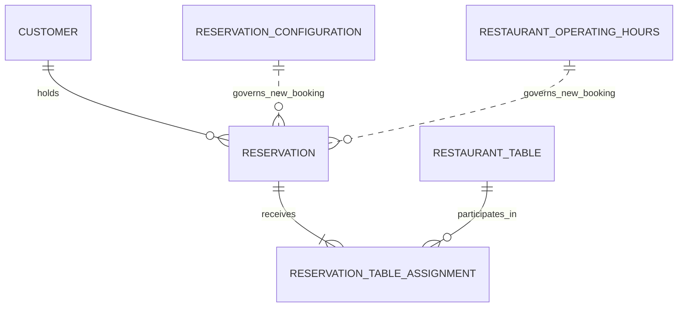

# Cafe Fausse DB-02 Conceptual Data Model

**Document version:** 1.3 
**Established:** 2026-08-15  
**Last amended:** 2026-09-02 
**Artifact regeneration ID:** `2026-09-02-PRA030-R1` 
**Roadmap increment:** DB-02  
**Authoritative sources:** `SRS(1).pdf`, `Rubric(1).pdf`, Project Requirements Addendum 2.3 (PRA-001 through PRA-030), approved DB-01 Persistent-Data Requirements Analysis 1.3, and the approved least-to-most implementation roadmap 1.1.1 
**Scope:** Conceptual PostgreSQL data model only  
**Status:** Approved  
**Approved by/date:** Abdul, 2026-08-15; PRA-030 amendment approved 2026-09-02 
**Approval source:** Explicit DB-02 approval after review of the PRA-029-amended model, followed by the explicit PRA-030 middle-initial amendment 
**Code status:** No SQL or application code generated

## 1. Purpose and boundary

This document defines the smallest normalized conceptual model that gives every approved persistent business fact and PostgreSQL business-configuration value one authoritative home. It establishes business entities, conceptual attributes, relationships, cardinalities, identity rules, invariants, lifecycle rules, derivations, and traceability.

Conceptual names describe business meaning only. They do not finalize PostgreSQL table or column names. This document does not choose data types, keys, constraints, indexes, identity mechanisms, migrations, fingerprint algorithms, transactions, locking, allocation implementation, Flask contracts, or React components.

## 2. Conceptual-model decision

Six persistent concepts are sufficient for Version 1:

| Conceptual entity | Purpose | Why it is a separate concept |
|---|---|---|
| Customer | Authoritative identity, contact information, and current newsletter preference for a person who has been persisted. | A customer may exist without a reservation and may hold many reservations. |
| Reservation Configuration | The single current set of PostgreSQL-controlled rules used prospectively for availability and new bookings. | Configuration changes independently from transaction data and has no Version 1 history. |
| Restaurant Operating Hours | The authoritative recurring weekly opening and closing schedule, seeded to the SRS hours. | Day-specific schedule values repeat by weekday and must be data-driven without becoming holiday/date-specific exception history. |
| Restaurant Table | One identifiable physical table and its current seating capacity. | Tables exist independently and participate in many nonoverlapping reservations over time. |
| Reservation | One immutable confirmed booking held by one customer, including its occupancy and retry identity. | The reservation is the durable business event that owns party size, occupancy, confirmation identity, and retry facts. |
| Reservation-Table Assignment | The persistent association of one reservation with one exclusively assigned restaurant table. | It resolves the many-to-many relationship between reservations and tables and supports one-or-more tables without duplicating either entity. |

No separate entity is created for newsletter subscribers, availability, time slots, confirmation, fingerprints, operating-hours exceptions/history, configuration history, reservation status, or customer profiles:

- current newsletter status belongs to Customer;
- availability and daily slot status are derived;
- confirmation is assembled from authoritative Customer, Reservation, Assignment, and fixed restaurant information;
- fingerprint and its semantic version belong to Reservation;
- only the current Reservation Configuration and current recurring Restaurant Operating Hours exist in Version 1;
- holiday/date-specific operating-hour exceptions and schedule history remain inactive future enhancements;
- confirmed reservations have no cancellation/no-show state machine;
- authentication and verified profiles are inactive future enhancements.

## 3. Conceptual entity-relationship model

The dotted Configuration-to-Reservation and Operating-Hours-to-Reservation relationships are behavioral, not retained historical associations. The current settings and recurring weekly schedule govern validation and creation of new reservations. Each reservation independently preserves its booked occupancy facts, so later configuration or schedule changes do not alter it.

### 3.1 Relationship optionality and cardinalities

| Relationship | From cardinality | To cardinality | Conceptual rule |
|---|---:|---:|---|
| Customer holds Reservation | A customer holds zero or many reservations. | Each reservation belongs to exactly one customer. | A newsletter-only customer is valid; an orphan reservation is not. |
| Reservation receives Assignment | Each confirmed reservation has one or more assignments. | Each assignment belongs to exactly one reservation. | A confirmed reservation cannot have zero assigned tables or a partial assignment set. |
| Restaurant Table participates in Assignment | A table participates in zero or many assignments over time. | Each assignment refers to exactly one table. | Assignments for the same table may not overlap in time. |
| Reservation Configuration governs new Reservation | One current configuration set governs zero or many prospective booking decisions. | Each new reservation is validated using the current set, but no historical configuration relationship is retained. | The immutable booked interval replaces any need to retain the configuration version used at booking. |
| Restaurant Operating Hours govern new Reservation | One current recurring schedule supplies a weekday rule for each day and governs zero or many prospective booking decisions. | Each new reservation uses the schedule applicable to its weekday, but no historical schedule relationship is retained. | Required seed values match the SRS; controlled alternate test schedules require no Flask logic change. |
| Reservation and Restaurant Table through Assignment | A reservation has one or many tables; a table serves zero or many reservations over time. | Each reservation-table pair occurs at most once. | This is a constrained many-to-many relationship with full-interval exclusivity. |

## 4. Conceptual entity and attribute catalogue

### 4.1 Customer

**Business definition:** The single authoritative record for a persisted restaurant customer, identified for business purposes by canonical normalized email. It contains the structured Customer Name required by the SRS, optional reservation contact information, and the one current newsletter preference.

**Authoritative sources:** SRS FR-06, FR-15 through FR-18; PRA-014, PRA-019 through PRA-023, PRA-027, PRA-028.

| Conceptual attribute | Meaning | Required? | Identity/source-of-truth rule | Lifecycle |
|---|---|---:|---|---|
| Customer identifier | Stable internal identity used by reservations and retry fingerprint generation. | Yes | Unique and immutable; representation is deferred. | Retained until controlled nonproduction reset. |
| First name | Required first component of SRS Customer Name. | Yes | After trimming/collapse: 1-100 characters and at least one letter. Display punctuation/accents are preserved; comparison is case-insensitive. It is not independently unique. | Must not be silently replaced. |
| Middle initial | Optional structured name component. | No | Request input, when supplied, is exactly one alphabetic character, maximum length one, with no period; lowercase may normalize to uppercase and the stored value remains uppercase without punctuation. It is not an identity key or fingerprint input. | Empty may be populated; omission preserves; a conflicting populated value is rejected. |
| Last name | Required last component of SRS Customer Name. | Yes | After trimming/collapse: 1-100 characters and at least one letter. Display punctuation/accents are preserved; comparison is case-insensitive. It is not independently unique. | Must not be silently replaced. |
| Canonical email | Required normalized email identity and marketing address. | Yes | Valid syntax, no more than 254 characters, and lowercase after trimming. It is the unique business identity for one customer. | Immutable through approved Version 1 workflows and retained after unsubscribe. |
| Phone number | Optional reservation contact information. | No | Approved characters are digits, spaces, plus, parentheses, hyphens, and periods, with 7-15 digits. It is not identity or a fingerprint input; normalized comparison is derived. | Blank may be populated; omission preserves; a differing stored value is not silently overwritten. |
| Current newsletter status | The customer's current subscribe/unsubscribe preference. | Yes for every persisted customer | The only Version 1 newsletter source of truth; Boolean current state. | Mutable independently with idempotent set semantics; unsubscribe retains the customer; no history is retained. |

**Values intentionally not modeled as Customer attributes:** confirmation-email entry, submitted newsletter action, normalized-phone helper representation, authentication data, verification state, profile metadata, audit history, and unapproved created/updated timestamps.

### 4.2 Reservation Configuration

**Business definition:** The one current set of PostgreSQL business settings applied prospectively when calculating availability and validating new reservations.

**Authoritative sources:** PRA-005 through PRA-012, PRA-023, PRA-025, PRA-026.

| Conceptual attribute | Meaning | Required? | Approved default and limits | Lifecycle |
|---|---|---:|---|---|
| Reservation start-time interval | Alignment spacing between legitimate daily starts. | Yes | Default 30 minutes; permitted 15, 30, or 60 minutes. | Current value only; changes apply prospectively. |
| Reservation duration | Complete occupancy duration used for new bookings. | Yes | Default 90 minutes; permitted 60, 90, or 120 minutes; no turnover buffer. | Current value only; changes do not alter existing reservations. |
| Maximum advance-booking window | Inclusive restaurant-local future-date limit. | Yes | Default 60 days; permitted 1 through 365 days. | Current value only; changes apply prospectively. |
| Same-day minimum lead time | Minimum interval from authoritative current time to a same-day start. | Yes | Default 120 minutes; permitted 0 through 1440 minutes. | Current value only; changes apply prospectively. |
| Restaurant timezone | IANA timezone used for reservation rules and display. | Yes | Default `America/New_York`; must be a valid IANA identifier. | Relatively fixed; changes must not reinterpret existing canonical reservation instants. |

Recurring weekly operating hours are normalized into the separate Restaurant Operating Hours concept rather than embedded in this scalar setting set. No configuration-history concept is included.

### 4.3 Restaurant Operating Hours

**Business definition:** The single authoritative recurring weekly schedule used by Flask to display restaurant hours, generate legitimate daily starts, and validate opening/closing boundaries. PostgreSQL stores the schedule so alternate recurring test/demo schedules require no Flask or React business-logic change.

**Authoritative sources:** SRS FR-02, FR-07, FR-18; PRA-008, PRA-009, PRA-023, PRA-025, PRA-026, PRA-029.

| Conceptual attribute | Meaning | Required? | Identity/source-of-truth rule | Lifecycle |
|---|---|---:|---|---|
| Weekday identity | The recurring day of week governed by this schedule rule. | Yes | Each weekday has exactly one current Version 1 rule; exact logical representation is deferred. | Retained as current business configuration. |
| Opening time | The restaurant-local opening boundary for the weekday. | Yes for the SRS seed | Monday-Saturday seed to 5:00 PM; Sunday seeds to 5:00 PM. | May change prospectively in controlled test/demo data. |
| Closing time | The restaurant-local closing boundary for the weekday. | Yes for the SRS seed | Monday-Saturday seed to 11:00 PM; Sunday seeds to 9:00 PM. | May change prospectively in controlled test/demo data. |

The Version 1 seed and normal demonstration baseline must exactly match the SRS. The exact logical table name, columns, time types, closed-day representation, and support for more than one daily service interval remain DB-03 decisions. Version 1 introduces no holiday/date-specific exception, schedule-history, or effective-dated schedule entity.

### 4.4 Restaurant Table

**Business definition:** One persistent physical table in the current Version 1 bookable inventory.

**Authoritative sources:** SRS FR-08, FR-17, FR-18; PRA-015 through PRA-018, PRA-026, PRA-028.

| Conceptual attribute | Meaning | Required? | Identity/source-of-truth rule | Lifecycle |
|---|---|---:|---|---|
| Table identifier/number | Stable identity and the SRS Table Number for a single-table reservation. | Yes | Unique among current restaurant tables. | Exactly 30 table instances exist during normal Version 1 operation. |
| Seating capacity | Current number of seats at this table. | Yes | Positive seating count; initial value four for each of the 30 tables. | Relatively fixed; prospective changes affect new calculations but not existing assignments. |

Exactly 30 current table instances is a Version 1 population invariant, not an independently editable count setting. The conceptual structure does not impose 30 as a permanent future schema maximum, but it provides no active/inactive mechanism and does not authorize more than 30 active Version 1 tables.

### 4.5 Reservation

**Business definition:** One immutable, confirmed booking held by exactly one customer for a complete half-open occupancy interval and a specified party size.

**Authoritative sources:** SRS FR-06 through FR-09, FR-17, FR-18; PRA-006 through PRA-018, PRA-022 through PRA-028.

| Conceptual attribute or relationship fact | Meaning | Required? | Identity/source-of-truth rule | Lifecycle |
|---|---|---:|---|---|
| Reservation identifier | Stable reservation identity and conceptual source for a confirmation reference. | Yes | Unique and immutable; whether the same value is exposed publicly is deferred. | Retained until controlled nonproduction reset. |
| Holding customer | The one Customer that owns the reservation. | Yes | Exactly one; customer identifier is also a fingerprint input. | Immutable relationship. |
| Canonical start instant | Unambiguous start of booked occupancy. | Yes | Validated using restaurant-local rules and preserved as an unambiguous time fact. | Immutable. |
| Immutable booked occupancy boundary | The end boundary or equivalent booked-duration snapshot needed to reproduce the original interval. | Yes | Establishes `[start,end)` independently of later duration-setting changes. Exact logical representation is deferred. | Immutable. |
| Party size | Number of guests covered by the reservation. | Yes | Integer 1 through the current derived maximum at booking and covered by the winning table combination. | Immutable and included in fingerprint inputs. |
| Fingerprint semantic version | Identifies the fingerprint-input semantics used for this reservation. | Yes | Initial conceptual label is `v1`; physical representation is deferred. | Immutable for the reservation. |
| Opaque reservation fingerprint | PostgreSQL-generated deterministic retry lookup aid. | Yes | Inputs are customer identifier, canonical start, and party size. It is not sufficient by itself to prove equality. | Immutable and retained with the reservation. |

No reservation status, cancellation data, modification history, created timestamp, configuration-version relationship, assigned-capacity snapshot, newsletter snapshot, or confirmation-delivery state is required.

### 4.6 Reservation-Table Assignment

**Business definition:** The durable fact that one restaurant table is assigned exclusively to one confirmed reservation for that reservation's complete occupancy interval.

**Authoritative sources:** SRS FR-08, FR-17, FR-18; PRA-013, PRA-015 through PRA-018, PRA-022, PRA-024, PRA-026, PRA-028.

| Conceptual attribute or relationship fact | Meaning | Required? | Identity/source-of-truth rule | Lifecycle |
|---|---|---:|---|---|
| Assigned reservation | The reservation receiving the table. | Yes | Exactly one reservation. | Immutable. |
| Assigned restaurant table | The table committed to the reservation. | Yes | Exactly one table. | Immutable. |

The conceptual identity is the reservation-table pair. The assignment has no independent business attributes. Its occupancy interval is derived from its parent reservation, and the table's capacity comes from Restaurant Table. Candidate combinations, unused seats, and random-tie information are transient derivations; only the winning assignments persist.

## 5. Conceptual identity, uniqueness, and business constraints

### 5.1 Identity and uniqueness

1. Each Customer has one stable customer identifier.
2. Canonical normalized email identifies at most one Customer and is the unique business identity.
3. First and last name participate in matching the Customer found by email but are not separate identity keys.
4. Middle initial and phone are neither Customer identity keys nor reservation-fingerprint inputs.
5. Each Restaurant Table has one stable unique identifier/number.
6. Each Reservation has one stable unique identifier/reference.
7. Each Reservation has exactly one fingerprint semantic version and one opaque fingerprint.
8. Fingerprint equality does not establish reservation equality; the related customer identifier, canonical start, and party size must also match.
9. Each reservation-table pair occurs at most once.

### 5.2 Customer and newsletter constraints

1. A Customer is created by a successfully committed reservation or an affirmative newsletter signup.
2. A new person's unselected newsletter preference alone creates no Customer.
3. A Customer may exist with zero reservations.
4. First and last names must match the Customer resolved by canonical email; mismatch is rejected generically.
5. Middle-initial and phone population/preservation rules do not create a general profile-update workflow.
6. Current newsletter status is a required Boolean on every persisted Customer.
7. Newsletter updates set a final state idempotently; valid concurrent updates use last-committed-write semantics.
8. A reservation-linked preference change succeeds or fails with the new reservation. An exact reservation retry never reapplies its submitted preference action and returns current Customer status.
9. No separate subscriber collection or preference-history collection exists.

### 5.3 Configuration, date, and time constraints

1. One current Reservation Configuration set supplies all five PostgreSQL business settings.
2. One current Restaurant Operating Hours schedule supplies exactly one recurring weekday rule for each day under the Version 1 conceptual model.
3. Initial and normal Version 1 schedule data must match the SRS: Monday-Saturday 5:00 PM-11:00 PM and Sunday 5:00 PM-9:00 PM.
4. PostgreSQL is the authoritative schedule source. Flask reads the current values; React receives them through Flask and neither layer owns hard-coded authoritative hour values.
5. Every scalar setting and weekday schedule rule has one current valid value; no configuration or schedule versions/effective dates are retained.
6. The earliest start is the current PostgreSQL opening time for the applicable weekday.
7. The latest valid start is derived from the current closing time, current duration, and start interval; it is not stored independently.
8. A new reservation must end no later than the current PostgreSQL closing time.
9. Valid dates run from the restaurant-local current date through the configured advance window, inclusive.
10. Same-day starts must meet the configured lead time using authoritative server/database time, never browser time.
11. Configuration or recurring-schedule changes affect new calculations only and do not alter any confirmed reservation.
12. Controlled alternate recurring test/demo schedules are permitted; holiday/date-specific exceptions remain outside Version 1.

### 5.4 Reservation and assignment constraints

1. Every confirmed Reservation belongs to exactly one Customer and has at least one Assignment.
2. Party size must be at least one and no greater than current total configured table capacity.
3. Actual success additionally requires a capacity-sufficient combination of tables that are free for the complete requested interval.
4. Reservation occupancy uses the half-open interval `[start,end)`. Two intervals overlap when each starts before the other ends; endpoint contact is allowed.
5. A Restaurant Table cannot participate in overlapping Assignments.
6. Every assigned table is exclusive for the entire parent Reservation interval; unused seats cannot be shared.
7. The combined capacity of winning assignments must cover party size when the reservation is created.
8. Later capacity changes do not recalculate, invalidate, or change an existing Reservation or Assignment.
9. A normalized-email Customer cannot hold a different overlapping Reservation, even when other table capacity is available.
10. An exact retry resolves to the existing Reservation; a nonmatching same-customer overlap is rejected.
11. Assignment is all-or-none. A confirmed Reservation cannot persist with only part of its winning table combination.
12. Candidate combinations are ranked by minimum table count, then least unused seating, then random selection among equal candidates. DB-02 requires the model to support these facts but does not design the algorithm or transaction mechanism.
13. Customers do not select tables and no adjacency/combinability restriction exists in Version 1.

## 6. Source-of-truth and classification assignments

| Information | Classification | Authoritative conceptual home or derivation | Must not become |
|---|---|---|---|
| Customer identity, structured name, canonical email, optional phone | Persistent business data | Customer | A separate profile/account source |
| Current newsletter status | Persistent business data | Customer | A subscriber entity or event history |
| Current start interval, duration, window, lead time, timezone | PostgreSQL business configuration | Reservation Configuration | Hard-coded duplicated settings or configuration history |
| Current recurring weekly opening/closing schedule | PostgreSQL business configuration | Restaurant Operating Hours | Hard-coded Flask/React authority, holiday exceptions, or schedule history |
| Table identity and current capacity | Persistent/configurable business data | Restaurant Table | A separate total-capacity record |
| Reservation identity, customer, occupancy, party size, fingerprint/version | Persistent business data | Reservation | Mutable booking state or duplicated confirmation snapshot |
| Winning table assignments | Persistent business relationship | Reservation-Table Assignment | Seat-sharing or candidate-combination history |
| Exactly 30 Version 1 tables | Fixed population invariant/derived count | Count of current Restaurant Table instances | A user-editable table-count setting |
| Total capacity and maximum party size | Derived | Sum of current Restaurant Table capacities | Independent configuration |
| Required SRS weekly hour values | SRS-controlled initial/default data | Restaurant Operating Hours seed | Duplicated constants outside PostgreSQL |
| Legitimate starts, latest start, free tables, eligible combinations, slot availability | Derived/transient | Current request + Operating Hours + current Configuration + Tables + Reservations + Assignments | Availability/slot ledger |
| Confirmation email and submitted newsletter action | Transient input | Request validation/processing | Customer duplicate or audit event |
| Confirmation display | Derived response | Customer + Reservation + Assignments + fixed address/phone + current newsletter status | Persistent confirmation entity |
| Fingerprint match result and same-customer overlap result | Derived request outcome | Reservation fingerprint and underlying Customer/start/party facts | Independent retry record |
| Current authoritative time | Transient/derived | Server/database clock | Stored booking-history fact |
| Optional timestamps or helper normalization representations | Deferred technical data | DB-03 decision if justified | New business requirements |
| Future-enhancement data | Inactive | No Version 1 home | Active entity or attribute |

## 7. Availability and overlap derivation

Availability is a request-scoped conclusion, not a stored entity or status.

For a requested restaurant-local date and party size, authoritative availability uses:

1. the current PostgreSQL recurring weekly operating-hours schedule seeded to the SRS baseline;
2. current Reservation Configuration values;
3. authoritative current time for same-day lead enforcement;
4. the 30 current Restaurant Tables and their capacities;
5. retained Reservations and their immutable half-open intervals;
6. retained Reservation-Table Assignments;
7. the same-customer overlap rule when a booking is submitted.

Legitimate daily starts are derived by reading the current PostgreSQL opening/closing boundaries for the requested weekday, aligning starts to the configured interval, and retaining only those whose full configured duration fits those boundaries, the date window, and the lead-time rule. For each legitimate interval, a table is free only when it has no Assignment whose parent Reservation overlaps that interval. The slot is provisionally available for the requested party size when at least one capacity-sufficient combination exists among the free tables.

The full daily slot list and each availability flag are recomputed. They may become stale immediately. Final booking therefore revalidates all rules and chooses/commits assignments authoritatively. The conceptual model supplies the required facts but does not define whether PostgreSQL or Flask performs each calculation, how candidates are enumerated, or how concurrent transactions are controlled.

Different customers may hold overlapping Reservations when their assigned tables remain exclusive and sufficient capacity exists. The same Customer may not hold a different overlapping Reservation. Back-to-back Reservations are allowed because `[start,end)` and `[end,next_end)` do not overlap.

## 8. Reservation retry and confirmation derivation

### 8.1 Exact retry

For each successful Reservation, PostgreSQL generates an opaque fingerprint under the stored semantic version using only:

- the resolved Customer identifier;
- the canonical Reservation start;
- the Reservation party size.

The separately stored semantic version identifies how those inputs are interpreted; it is not an additional fingerprint input. Name text, email text, middle initial, phone, newsletter status/action, assigned tables, reservation end, and current configuration are excluded.

A matching fingerprint identifies candidates only. Exact retry requires verification that the stored Customer relationship, canonical start, and party size equal the incoming resolved facts. If verified, the existing Reservation and confirmation are returned without creating new business data. If the same Customer requests a different overlapping booking, the request is rejected. Algorithm, encoding, collision handling implementation, and transaction ordering remain DB-03/DB-04 decisions.

### 8.2 Confirmation

Confirmation is a derived response, not a persistent entity. It is assembled from:

- stable Reservation identifier or an approved safe representation of it;
- Customer structured name;
- Reservation start and immutable end in restaurant-local display form;
- Reservation party size;
- all assigned Restaurant Table numbers through Assignment;
- current Customer newsletter status;
- fixed SRS restaurant address and phone.

An exact retry reassembles the same reservation facts while returning the Customer's current newsletter state. No email/SMS delivery status or historical newsletter snapshot exists.

## 9. Lifecycle and retention

| Concept | Creation | Permitted Version 1 change | Normal-operation retention | Controlled reset behavior |
|---|---|---|---|---|
| Customer | Successful reservation or affirmative new newsletter signup | Current newsletter status; limited population of blank middle initial/phone under approved rules | Retained after unsubscribe and after all reservations become past | May be removed only as designated nonproduction data |
| Reservation Configuration | Initialized with approved defaults | Current valid values may change prospectively | Current set retained; no history | Restored to known approved defaults |
| Restaurant Operating Hours | Seeded with seven recurring weekday rules matching the SRS hours | Current recurring values may change prospectively in controlled test/demo data | Current schedule retained; no holiday exceptions or history | Restored to the SRS weekly baseline |
| Restaurant Table | Initialized as exactly 30 tables, each capacity four | Individual capacity may change prospectively; seating is relatively fixed | All 30 retained in normal Version 1 operation | Re-created in the known 30-by-4 baseline |
| Reservation | Created only after successful authoritative booking | None; immutable | Retained after interval elapses; elapsed interval no longer affects availability | May be removed as designated nonproduction data |
| Reservation-Table Assignment | Created atomically with its Reservation | None; immutable | Retained with Reservation | Removed/re-created only through controlled nonproduction reset |

There is no automatic deletion, archive, anonymization, retention-period purge, cancellation, rescheduling, no-show transition, or partial assignment release.

## 10. SRS minimum-field mismatch reconciliation

| SRS minimum or omission | Conceptual resolution | Why it is additive, not contradictory |
|---|---|---|
| Singular Customer Name | Customer has required first name, optional middle initial, and required last name. | The components collectively preserve the complete required name while enabling deterministic matching. |
| Number of Guests appears on the form but not in minimum Reservations fields | Party size belongs to Reservation. | It preserves an explicit SRS form value and is necessary for capacity/availability logic. |
| Singular Time Slot | Reservation preserves canonical start plus an immutable booked end-or-duration boundary. | It operationalizes the selected slot for closing and overlap protection without changing the required selected start. |
| Singular Table Number | Each Assignment preserves one concrete Restaurant Table number; a Reservation has one or more Assignments. | A single-table booking still has exactly one Table Number, while larger parties add multiple required table numbers. |
| Thirty tables but no table inventory/capacity definition | Restaurant Table provides 30 persistent identities and individual capacities, initially four. | It makes the SRS's table assignment and full-slot behavior deterministic without activating more than 30 tables. |
| No stated configuration fields or operating-hours storage structure | Reservation Configuration contains the five scalar settings, while Restaurant Operating Hours contains the recurring weekly schedule seeded exactly to the SRS values. | The scalar settings refine validity gaps; database-backed hours preserve literal SRS compliance while preventing duplicated Flask/React authority. |
| Newsletter signup could imply a separate subscriber list | Current newsletter status belongs only to Customer; the dedicated form remains. | It fulfills the SRS Customers Newsletter Signup field and backend storage while avoiding contradictory sources. |
| No retry correlation information | Reservation contains a database-generated versioned fingerprint. | It strengthens reliable confirmation and double-booking prevention without changing customer-facing booking inputs. |
| Success message without specified stable data | Confirmation is assembled from authoritative Customer, Reservation, Assignment, and fixed restaurant facts. | It provides the approved success evidence without duplicating business data. |
| No retention/reset rule | Normal data is retained; controlled reset is limited to nonproduction demonstration/test use. | It supports reliable storage and rubric demonstration repeatability without adding customer deletion functionality. |

## 11. DB-01 data-item-to-conceptual-home coverage matrix

Every DB-01 item has exactly one persistent home or one explicit nonpersistent classification.

### 11.1 Customer and configuration items

| DB-01 item | Conceptual home/classification | Treatment |
|---|---|---|
| CUS-01 | Customer | Customer identifier |
| CUS-02 | Customer | First name |
| CUS-03 | Customer | Optional middle initial |
| CUS-04 | Customer | Last name |
| CUS-05 | Customer | Canonical email and business identity |
| CUS-06 | Transient validation | Confirmation email is not persisted |
| CUS-07 | Customer | Optional phone |
| CUS-08 | Customer-derived/deferred technical representation | Normalized phone comparison is not an independent fact |
| CUS-09 | Customer | Current newsletter Boolean |
| CUS-10 | Transient request intent | Applied to Customer state; no event retention |
| CUS-11 | Deferred technical data | Optional timestamps remain a DB-03 decision |
| CFG-01 | Reservation Configuration | Current start interval |
| CFG-02 | Reservation Configuration; booked outcome in Reservation | Current duration governs new bookings; Reservation preserves immutable occupancy |
| CFG-03 | Reservation Configuration | Current maximum advance window |
| CFG-04 | Reservation Configuration | Current same-day lead time |
| CFG-05 | Reservation Configuration | Current restaurant timezone |
| FIX-01 | Restaurant Operating Hours | Stable DB-01 identifier retained after PRA-029 reclassification; recurring hours are PostgreSQL business configuration seeded to the SRS schedule |
| CFG-06 | Future enhancement excluded | No configuration history/effective dates |

### 11.2 Table, reservation, and assignment items

| DB-01 item | Conceptual home/classification | Treatment |
|---|---|---|
| TBL-01 | Restaurant Table | Stable table identifier/number |
| TBL-02 | Restaurant Table | Current individual seating capacity |
| TBL-03 | Fixed/derived population invariant | Exactly 30 Restaurant Table instances |
| TBL-04 | Derived from Restaurant Table | Sum of capacities; not stored independently |
| TBL-05 | Derived from Restaurant Table | Equals total capacity; not separate setting |
| TBL-06 | Deferred/future mechanism excluded | No active/bookable lifecycle is required |
| TBL-07 | Future enhancement excluded | No adjacency/combinability data |
| RSV-01 | Reservation | Stable identifier/confirmation source |
| RSV-02 | Reservation-to-Customer relationship | Exactly one holding Customer |
| RSV-03 | Reservation | Canonical start instant |
| RSV-04 | Reservation | Immutable occupancy boundary/end-or-duration fact |
| RSV-05 | Reservation | Party size |
| RSV-06 | Reservation | Fingerprint semantic version |
| RSV-07 | Reservation | Opaque database-generated fingerprint |
| RSV-08 | Deferred technical data | Optional creation timestamp remains DB-03 decision |
| RSV-09 | Future/deferred status excluded | No Version 1 reservation state machine |
| RSV-10 | Future enhancement excluded | No cancellation/modification data |
| ASN-01 | Reservation-Table Assignment | Winning persistent reservation-table pair |
| ASN-02 | Derived from Reservation | Assignment uses parent `[start,end)`; no duplicate interval |
| ASN-03 | Derived during allocation | Assigned capacity sum is not retained independently |
| ASN-04 | Derived during allocation | Unused seats are not retained |
| ASN-05 | Transient candidate process | Only winning Assignments persist |

### 11.3 Availability, retry, and confirmation items

| DB-01 item | Conceptual home/classification | Treatment |
|---|---|---|
| AVL-01 | Transient availability input | Requested restaurant-local date |
| AVL-02 | Transient availability input | Party size becomes Reservation data only on success |
| AVL-03 | Derived | Legitimate starts from rules/configuration |
| AVL-04 | Derived | Provisional slot status |
| AVL-05 | Derived/transient | Free-table set from Reservations and Assignments |
| AVL-06 | Derived/transient | Eligible combinations; only winner persists |
| AVL-07 | Derived from Restaurant Table | Current maximum display value |
| AVL-08 | Derived | Latest start from close, duration, and interval |
| AVL-09 | Derived request outcome | Same-customer overlap from Customer and Reservations |
| AVL-10 | Transient/derived | Authoritative current server/database time |
| CNF-01 | Reservation | Stable identifier is the conceptual confirmation source |
| CNF-02 | Derived from Customer | Structured display name |
| CNF-03 | Derived from Reservation and current display timezone | Booked start/end display |
| CNF-04 | Reservation | Party size reused, not duplicated |
| CNF-05 | Derived through Assignments and Restaurant Table | All assigned table numbers |
| CNF-06 | Customer | Current newsletter status reused, not snapshotted |
| CNF-07 | Fixed SRS content | Address and phone are not database business data |
| CNF-08 | Future enhancement excluded | No email/SMS delivery or status |

## 12. Requirements traceability

### 12.1 Entity and relationship traceability

| Concept | SRS | Addendum | Rubric relevance |
|---|---|---|---|
| Customer | FR-06, FR-15 through FR-18 | PRA-014, PRA-019 through PRA-024, PRA-027, PRA-028 | Working reservation/newsletter forms, PostgreSQL effects, full-stack integration |
| Reservation Configuration | FR-07, FR-08, FR-18; NFR-05 | PRA-005 through PRA-013, PRA-015, PRA-023, PRA-025, PRA-026 | Sophisticated reservation logic and data integrity |
| Restaurant Operating Hours | FR-02, FR-07, FR-18; NFR-05 | PRA-008, PRA-009, PRA-023, PRA-025, PRA-026, PRA-029 | Complete SRS schedule, database-driven slot logic, integration, and direct database effects |
| Restaurant Table | FR-08, FR-17, FR-18; NFR-05 | PRA-015 through PRA-018, PRA-026, PRA-028 | Thirty-table assignment, PostgreSQL integration, direct database effects |
| Reservation | FR-06 through FR-09, FR-17, FR-18; NFR-05 | PRA-006 through PRA-018, PRA-022 through PRA-028 | Correct reservation system, confirmation, sophisticated logic, database effects |
| Reservation-Table Assignment | FR-08, FR-17, FR-18; NFR-05 | PRA-013, PRA-015 through PRA-018, PRA-022, PRA-024, PRA-026, PRA-028 | Assignment evidence, prevention of double/overbooking, sophisticated logic |
| Customer-to-Reservation | FR-17, FR-18 | PRA-014, PRA-019, PRA-022, PRA-027 | Integrated customer/reservation persistence |
| Reservation-to-Assignment-to-Table | FR-08, FR-17, FR-18 | PRA-013, PRA-015 through PRA-018, PRA-024, PRA-026 | Direct database proof of single/multi-table assignments and exclusivity |
| Derived availability | FR-07 through FR-09, FR-18; NFR-05 | PRA-006 through PRA-018, PRA-023, PRA-025, PRA-029 | Working forms, database-backed hours, full-slot behavior, sophisticated reservation logic |
| Derived confirmation/retry | FR-09, FR-18; NFR-05, NFR-06 | PRA-014, PRA-024, PRA-027 | Successful confirmation, safe retry, database integrity |

### 12.2 PRA coverage

| PRA ID | DB-02 treatment |
|---|---|
| PRA-001 | DB-02 remains inside the PostgreSQL phase; no Flask, React, or integration design is introduced. |
| PRA-002 | The model uses the smallest normalized set of six persistent concepts. |
| PRA-003 | Non-executable model-review and future integration scenarios are defined. |
| PRA-004 | All conceptual facts trace to the fixed SRS, rubric, or approved addendum. |
| PRA-005 | The five approved variable rules belong to Reservation Configuration rather than duplicated hard-coded sources. |
| PRA-006 | Start-time interval is current configuration; legitimate aligned starts are derived. |
| PRA-007 | Current duration governs new bookings; each Reservation preserves its immutable booked occupancy. |
| PRA-008 | The recurring weekly schedule is seeded to the SRS values; exceptional closures remain excluded. |
| PRA-009 | Earliest/latest starts derive from current database-backed opening/closing values, duration, and interval. |
| PRA-010 | Maximum advance window belongs to current Reservation Configuration. |
| PRA-011 | Same-day lead time belongs to current Reservation Configuration and uses authoritative time. |
| PRA-012 | Restaurant timezone belongs to current Reservation Configuration; reservation instants remain unambiguous. |
| PRA-013 | Reservation occupancy and assignment exclusivity use half-open intervals. |
| PRA-014 | Customer overlap and exact-retry distinctions are supported by Customer and Reservation facts. |
| PRA-015 | Party size belongs to Reservation; maximum party size is derived from current table capacity. |
| PRA-016 | Exactly 30 Restaurant Table instances are a Version 1 population invariant. |
| PRA-017 | Seating capacity belongs individually to each Restaurant Table, initially four. |
| PRA-018 | Reservation-Table Assignment supports one-or-more exclusive tables and winning-combination persistence. |
| PRA-019 | Customer owns structured name, canonical email identity, optional phone, and current newsletter state. |
| PRA-020 | Customer is the only newsletter source of truth; no subscriber entity exists. |
| PRA-021 | Current newsletter state supports idempotent final-state updates without history. |
| PRA-022 | Immutable reservations with no cancellation/modification lifecycle. |
| PRA-023 | Conceptual placement of validated persistent values and exclusion of transient confirmation input. |
| PRA-024 | Confirmation derived from authoritative sources; no delivery claim/entity. |
| PRA-025 | Availability remains derived and provisional; no slot ledger. |
| PRA-026 | Prospective scalar-configuration, recurring-hours, and table-capacity changes plus controlled known-state reset. |
| PRA-027 | Database-generated versioned fingerprint, underlying-fact verification, and newsletter separation. |
| PRA-028 | Normal-operation retention and no automatic purge/archive. |
| PRA-029 | Restaurant Operating Hours is the authoritative PostgreSQL recurring schedule; Flask/React do not own hard-coded hour values and holiday exceptions remain excluded. |
| PRA-030 | Middle-initial request input is optional and, when supplied, exactly one alphabetic character without a period; the stored value remains optional, one-character, and uppercase. |

### 12.3 Rubric traceability

| Rubric score-5 expectation | Conceptual-model support |
|---|---|
| All SRS requirements implemented | The SRS minimum Customer and Reservation data has an authoritative conceptual home, including additive fields required by the form and approved rules. |
| Flask and PostgreSQL correctly integrated with React | The model supplies stable authoritative facts for later API/UI contracts without assigning authority to React. |
| Correct reservation and newsletter database effects | Customer holds the only newsletter state; Reservation and Assignment expose direct persistent effects. |
| Sophisticated reservation logic | The model supports database-backed recurring hours, configurable slots/duration, individual capacities, multi-table allocation, exclusivity, overlap, and safe retry. |
| Demonstrable backend database state | Customer, Reservation, Restaurant Operating Hours, Restaurant Table, Configuration, and Assignment facts can later be shown directly in PostgreSQL. |
| Maintainable/documented solution | Entity ownership, exclusions, and traceability prevent duplicated state and preserve NFR-09. |

## 13. Conceptual model-review scenarios

These are non-executable review cases. They define expected traversal and invariants without selecting implementation mechanisms.

| Scenario | Conceptual traversal | Expected outcome |
|---|---|---|
| New reservation customer | Resolve canonical email; no Customer exists; validate details; create Customer with current preference as part of successful Reservation. | One Customer, one Reservation, and one-or-more Assignments persist together; no duplicate newsletter entity. |
| Matching existing customer | Resolve Customer by canonical email; match first/last name; apply approved optional-field rules. | Existing Customer is reused; a new valid Reservation may be related to it. |
| Email/name mismatch | Canonical email resolves a Customer but first/last name do not match. | Reject generically; no Customer or Reservation data changes. |
| Newsletter-only customer | New valid identity with newsletter selected. | Create one Customer with status true and zero Reservations. |
| New unselected newsletter form | No Customer exists and newsletter is unselected. | Create no persistent record. |
| Independent preference change | Matching Customer sets current status true or false. | Update only Customer current status; reservations/assignments remain unchanged; same-state repeat succeeds. |
| Single-table reservation | One free table has sufficient capacity. | One Reservation receives exactly one Assignment; its table is exclusive for the full interval. |
| Multi-table reservation | No single table is sufficient; a free capacity-sufficient combination exists. | One Reservation receives all winning Assignments atomically; no assigned table/seat is shared. |
| Unavailable combination | Free tables cannot form a sufficient eligible combination. | No Reservation or partial Assignment persists; slot is unavailable at revalidation. |
| Different customers overlap with capacity | Two Customers request overlapping intervals and disjoint capacity-sufficient tables exist. | Both Reservations may exist with nonoverlapping table participation. |
| Same customer different overlap | Existing Customer has an overlapping Reservation; incoming request is not an exact retry. | Reject even if other tables are free. |
| Back-to-back reservation | New start equals prior end on the same table. | Allowed because half-open intervals do not overlap. |
| Exact retry | Fingerprint candidate and underlying Customer/start/party facts match. | Return existing Reservation/confirmation; create nothing; return current newsletter state without replaying action. |
| Fingerprint collision | Opaque fingerprint matches but an underlying fact differs. | Do not treat as exact retry; apply normal conflict/availability behavior. |
| Configuration or recurring-hours change | Current duration, table capacity, or a weekday opening/closing value changes after a Reservation was confirmed. | Existing Reservation interval and Assignments remain unchanged; new calculations and displayed hours use current PostgreSQL values. |
| Alternate recurring test schedule | Isolated test/demo seed changes one or more weekday hours without introducing date-specific exceptions. | Flask derives different legitimate slots and React receives the updated hours without business-logic changes; reset restores the SRS seed. |
| Retained past reservation | Reservation end is before authoritative current time. | Record and Assignments remain stored but do not block a later nonoverlapping interval. |
| Controlled academic-demo reinitialization | Designated nonproduction reservation data is cleared and known defaults restored later through approved tooling. | Environment returns to exactly 30 tables at capacity four and approved configuration defaults; this is not a customer workflow. |

## 14. Explicit Version 1 exclusions

The conceptual model contains no entity or attribute for:

- authentication credentials, sessions, roles, or authorization;
- verified profiles or email-verification tokens/history;
- automatic form-prefill metadata;
- reservation cancellation, modification, rescheduling, reasons, or status history;
- no-show handling;
- administrative users/actions;
- holiday or exceptional-closure dates;
- hard-coded authoritative weekly-hour values in Flask or React;
- newsletter subscription events/history/audit;
- confirmation email/SMS messages or delivery status;
- table adjacency, floor plan, or physical combinability;
- more than 30 active Version 1 tables;
- general customer self-service updates or contact-history records;
- retroactive configuration recalculation;
- effective-dated configuration history;
- production archive, anonymization, purge, or deletion-policy data;
- persistent availability, free/busy, slot, or candidate-combination records;
- a separate newsletter subscriber source;
- persisted confirmation-email duplicates.

## 15. Decisions deferred to DB-03, DB-04, and later increments

### 15.1 DB-03 logical PostgreSQL schema

- final table and column names;
- PostgreSQL data types;
- primary, foreign, natural, and surrogate key choices;
- nullability, uniqueness, and check constraints;
- normalized comparison-value representation;
- exact representation of booked end versus booked-duration snapshot;
- exact representation of the five current configuration settings;
- exact recurring-operating-hours table name, weekday representation, opening/closing columns, time types, constraints, supported daily-period structure, and closed-day behavior;
- exact representation of the Assignment association;
- whether Reservation ID is exposed directly or mapped to a separate safe reference;
- whether optional technical timestamps are justified;
- fingerprint/version storage format;
- indexes and migration ordering.

### 15.2 DB-04 transaction and concurrency design

- transaction boundaries and all-or-none implementation;
- isolation level and locking strategy;
- overlap/exclusivity enforcement mechanism;
- exact retry-check ordering and collision-verification mechanism;
- candidate enumeration and allocation implementation;
- minimum-table/least-waste/random-tie execution details;
- concurrent newsletter/reservation behavior implementation;
- deterministic randomness test seam.

### 15.3 Later increments

- reset/seed script commands and safety guards;
- PostgreSQL-versus-Flask division of availability calculations;
- Flask endpoint and payload contracts;
- React component/state design;
- logging framework and technical log storage;
- performance materialization or caching, if justified.

## 16. Remaining unresolved conceptual decisions

No genuinely unresolved conceptual-model business decision remains.

The six-entity model resolves the DB-01 conceptual questions, including the PRA-029 operating-hours override, without selecting logical or physical structures. The alternative physical representations listed in Section 15 are intentionally scheduled for DB-03 or DB-04 and are not DB-02 blockers.

## 17. DB-02 completion assessment and approval checkpoint

### 17.1 Completion assessment

| DB-02 criterion | Result |
|---|---|
| Smallest normalized conceptual model established | Complete: six persistent concepts |
| Every persistent/configured DB-01 item has one authoritative home | Complete |
| Derived/transient/fixed/future data separated | Complete |
| Customer and newsletter source of truth preserved | Complete |
| Exactly 30 tables and individual capacities preserved | Complete |
| PostgreSQL-backed recurring weekly schedule and SRS seed preserved | Complete |
| Reservation occupancy and one-or-more exclusive assignments modeled | Complete |
| Availability remains derived | Complete |
| Fingerprint/retry facts modeled without implementation design | Complete |
| Identity, uniqueness, lifecycle, and retention documented | Complete |
| SRS minimum-field mismatches reconciled | Complete |
| DB-01 coverage matrix completed | Complete |
| SRS, rubric, and PRA traceability completed | Complete |
| Conceptual review scenarios completed | Complete |
| Future enhancements excluded | Complete |
| DB-03/DB-04 decisions deferred | Complete |
| SQL/application code avoided | Complete |

### 17.2 Approval record

DB-02 version 1.3 remains **approved**. It includes the six-concept model, the PRA-029 operating-hours amendment, and PRA-030's approved request-validation refinement. PRA-030 does not introduce a new persistent concept or schema change.

DB-02 approval authorizes Prompt 6 / DB-03 logical PostgreSQL schema and integrity design. It does not approve SQL, migrations, transaction/concurrency mechanisms, Flask contracts, React design, or implementation code.

### 17.3 Version record

| Version | Date | Change |
|---|---|---|
| 1.1 | 2026-08-15 | Added the PRA-029 operating-hours amendment and expanded the conceptual model to six persistent concepts. |
| 1.1.1 | 2026-08-15 | Regenerated the downloadable PRA-029-amended artifact without changing requirements or conceptual decisions. |
| 1.2 | 2026-08-15 | Recorded Abdul's explicit DB-02 approval and authorization to proceed to Prompt 6 / DB-03. No conceptual-model content changed. |
| 1.3 | 2026-09-02 | Applied PRA-030's optional one-character, no-period middle-initial request rule while preserving the existing optional one-character uppercase stored representation and conceptual model. |

No SQL or application code was generated.
